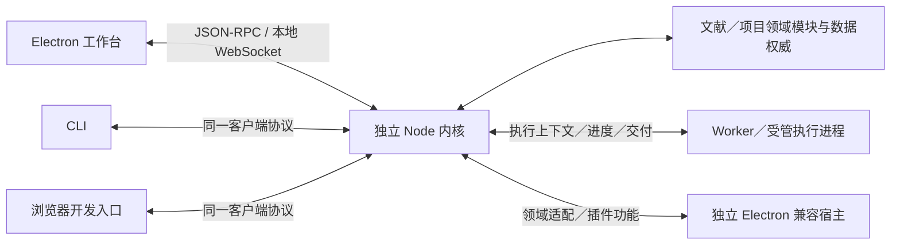

# 确定领域模块、Electron 进程与扩展宿主的架构

Labels: wayfinder:grilling
Type: grilling
Mode: HITL
Status: resolved
Assignee: 本会话 Codex；与用户讨论模块、进程与执行架构（2026-10-04）
Parent: [Scholoom：产品与工程基础决策地图](../map.md)
Blocked by: 05, 06, 07, 08, 13, 16, 18, 19

## Question

科研 Agent 内核、研究领域能力与人类工作台如何组成稳定模块，哪些能力运行在 Electron main、renderer、独立 Node 进程或兼容宿主中？如何让工作台与 Agent 接入同一科研系统，同时控制故障、并发写入和扩展的宿主依赖？

架构须满足[全流程产品形态与真实使用验收](01-first-product-loop.md)确定的无工作台执行和后续接入要求，进程与通信方式见本票 Answer。

[科研 Agent harness 与执行路线](07-agent-runtime-boundaries.md)已确定 LangGraph 系列基础和原生科研能力融合。模块共同实现任务身份、授权、调度、产物交付、正式节点与恢复契约，本票据此选择接口和物理部署方式。

具体职责以[科研能力的运行时契约](18-native-capability-runtime-and-content.md)为依据；[源码复用取舍](19-existing-source-and-rust-reuse.md)已确认 Synthesis 先采用 TypeScript，吸纳 main、历史和适用 dev 实现。重计算应与工作台、桌面 main 和 Agent 调度的事件循环分离；本票选择 Worker、计算进程、数据通道、进度、取消与执行监督方式，使其仍由同一 harness 管理。Rust 可按具体实现收益后续评估，当前不整体迁入旧 Synthesis 子系统。

原生契约已确定共同执行上下文、获授权服务、分批交付、正式决定与恢复接口。本票选择这些接口跨进程的承载、代码装载和执行监督方式，并落实 Node 程序、脚本、兼容宿主与外部 Agent 的实际权限边界。

遵循已确认的[低摩擦协同方案](13-storage-and-change-model.md)：普通文件通过获授权工具直接操作，Agent 适应常见变化；领域服务维护明确管理的结构化事实。局部保存、任务摘要与按需恢复满足日常工作，不默认建设覆盖所有文件操作的事务、审计或版本冻结系统。

Zotero 兼容宿主已由 [#16](16-zotero-host-prototype.md) 确定为 Node＋Chromium，固定 Zotero 10 基线、以重要插件推动通用宿主适配，不承诺全部插件无缝运行。本票落实兼容层模块、内部 DOM／Worker 与科研内核／工作台的物理部署、通信和共同文献权威接入；不再把宿主路线作为未决前提。

讨论接口和 DTO、IPC 边界、长期任务生命周期、工作台接入与退出时的执行行为、插件及原生扩展接入、读模型和变更提交。先确定模块职责，再选择物理进程划分；不照搬 Nimbalyst 的进程数量，也不把进程隔离等同于文件系统权限隔离。给出足够支持选型的架构，避免提前拆出无实际需要的服务或包。

## Answer

2026-10-04 用户依次确认独立后台内核、可信代码执行、原生模块集中部署（Q3）、共同客户端协议（Q4）、单内核实例（Q5）与原生能力执行分工（Q6），最后回复“批准”确认兼容宿主部署（Q7）和执行故障处理（Q8）。架构选择已收敛，本票解决；正式决定如下。

### 独立后台内核

科研内核具有独立于 Electron 桌面应用生命周期的后台运行入口，由 GUI 或 CLI 按需启动并连接。关闭工作台及退出桌面界面不自动终止正在运行的内核；明确停止内核时按任务暂停／恢复约定处理。默认不要求开机自启。工作台作为客户端查看和介入同一科研系统，启动与连接沿下述 Q4／Q5 契约实现。

### 可信代码执行

首阶段按可信代码执行用户明确启用的插件与程序，提供受管执行、取消和故障处理。内核提供的工具按任务授权控制操作；程序直接访问系统资源与内核工具授权分别表达。普通子进程、受限上下文和 Node 权限模型不作为任意代码的安全隔离承诺。本阶段不建设任意扩展代码的强隔离环境。

### 原生内核模块集中部署（Q3）

首阶段将 Agent／workflow／任务管理，以及文献、项目、证据和稿件等原生领域模块集中部署在一个独立 Node 内核进程中。模块通过明确接口协作，一个内核可管理全局文献库与多个项目；不按领域逐一拆成微服务。

Electron main 承担窗口与系统集成，工作台承担编辑和呈现，两者作为内核客户端。Zotero 兼容宿主及所需 DOM／Workers 分开执行，由内核监督并接入同一文献权威。重计算进入 Worker，用户程序、外部 Agent、脚本与工具按下述 Q6 分工采用受管进程；宿主部署与故障处理沿 Q7／Q8 实现。后续按实际性能与故障边界调整部署。

### 共同客户端协议（Q4）

Scholoom 自有 app-server 接口采用统一双向 JSON-RPC，以本地 WebSocket 作为 Electron 工作台、CLI 和浏览器开发入口连接同一独立内核的共同传输。操作请求、状态与增量通知、人类介入请求共用协议；协议 Schema 为共同事实源，生成客户端类型。监听限于本机并验证客户端身份。stdio 适配在存在具体子进程接入需求时再增加。

任务与会话身份独立于连接和 RPC 请求编号；客户端断线不自动取消任务。重连读取当前状态、待处理介入请求并重新订阅。订阅须覆盖读取与接入之间的变化，采用有界补发或重新读取等方式避免遗漏；不预设完整事件回放系统。多个客户端观察同一内核，介入答复由内核校验并只应用一次。

借鉴的是 Codex app-server 的通信模式；执行引擎沿用已选定的 LangGraph 原生运行时，领域接口沿用 Scholoom 科研模型。MCP／ACP 作为外部协议适配，共同调用内核接口。具体连接与恢复实现随接口设计落实。

### 内核实例与启动协调（Q5）

同一应用数据配置只由一个内核实例管理，该实例可同时管理全局文献库和多个项目。GUI／CLI 共用启动与发现机制：已有内核时连接它，并发启动时协调出一个实例；连接失败先判断内核状态，避免重复启动。开发与测试使用独立数据目录。实例发现、启动协调与身份验证的具体机制由实现规格确定。

### 原生能力装载与执行（Q6）

| 代码职责 | 执行位置 |
| --- | --- |
| 内置领域模块、Agent 调度和轻量能力 | 内核进程 |
| 重计算 | Worker |
| 用户添加的 JS／TS 程序及自定义图 | 受管执行进程 |
| Python、命令行工具与外部 Agent | 各自的受管进程 |

内核统一管理任务、授权、进度、交付和取消；外部执行代码通过共同接口访问领域对象。执行上下文的任务与调用身份、获授权接口、事件、取消及交付通道沿 #18 的共同契约提供。更新用户程序或终止卡住的执行时，处理对应执行进程；运行中的调用如何采用更新内容沿既有方法与版本约定处理。进程分离用于故障处理和取消，沿用可信代码执行范围。

### 兼容宿主部署与生命周期（Q7）

以独立 Electron 宿主实例承载 Node＋Chromium 兼容环境，由内核按需启动和监督；该实例包含自身的 main、内部页面及所需 Workers，不代表单一 OS 进程。同一应用数据配置先共用一个兼容宿主。插件对象身份与缓存在宿主内维护，文献读写经适配接入共同领域权威；插件专属状态沿 #16 的职责划分保存。

启用后台插件工作时无需先打开人类工作台，关闭工作台不销毁宿主。宿主内部页面按插件契约提供，所需桌面／显示运行条件随跨平台分发验收落实。具体 Node 与 Chromium 脚本划分按固定基线和插件需要实现，不逐包固定为架构决定；独立封装和插件支持范围按实际验收记录。

### 执行取消与故障处理（Q8）

- 取消先停止后续调度并请求执行协作退出，超过允许时间后终止对应受管执行单元，监督范围包括受管子进程。已完成的产物与实际修改保留。
- 执行崩溃只处理受影响调用；共享宿主故障时标记全部受影响调用。可以重新启动执行环境，仅对确认可安全重试的操作有限重试；效果未知的写入先核查。
- 内核意外退出后，下次启动将未正常结束的执行识别为中断，从任务摘要、当前材料和可用 checkpoint 续做。首阶段不添加额外常驻监督守护进程，不盲目重放所有调用。

具体超时、进程树终止、Worker 取消和恢复接线由实现及平台验收确定。上述是受管执行的处理契约，不承诺应用自身故障不会影响内核，也不将取消等同于撤销已经完成的操作。

### 接口与实现承接

各入口和执行适配复用 #18 的共同调用与执行上下文；客户端协议传递领域 DTO、操作、结果和事件，兼容宿主内部继续维护 #16 要求的 Zotero 对象语义。领域规则和明确管理的结构化事实通过内核共同接口维护，普通文件沿 #13 的授权与开放编辑约定操作，派生索引和缓存保留可重建职责。

图中领域模块部署在 Node 内核内，Worker 与受管执行进程按上述分工运行；模块不自动对应独立服务或发布包。读取、订阅和投影按当前任务与对象范围实现，具体 DTO、缓存更新及保存机制进入实现规格。

[技术栈票 #12](12-technology-stack.md)据此选择框架、数据库接入、组件、工具链、仓库结构与运行时分发；具体启动发现、内部 IPC、接口字段和平台接线随实现规格落实。[验证与发布票 #15](15-validation-and-release-discipline.md)承接生命周期、取消、故障恢复及插件支持范围的验收。实现路线继续由用户决定时机，本票完成不自动启动实现规划、实验或应用开发。

## Comments

2026-10-04 用户要求继续下一票，本票已领取。前置票均已 resolved；沿用科研内核可无工作台执行、关窗后任务可继续、共同领域服务维护结构化事实、重计算脱离关键事件循环，以及 Node＋Chromium Zotero 兼容层的已确认选择。

第一轮讨论两个尚未确认的取舍：科研内核是否具有独立于 Electron 桌面应用生命周期的后台运行入口；用户启用的程序／插件采用可信代码执行，还是首阶段就要求任意扩展代码的强隔离。前者影响启动、连接与退出监督，后者影响执行装载与权限实现。提出的方案不记为正式决定。

机制依据：[Electron utilityProcess](https://www.electronjs.org/docs/latest/api/utility-process) 是带 Node 的子进程，启动依赖 App ready；它可以承载桌面侧执行，但不自动提供独立启动契约。[Node 权限说明](https://nodejs.org/api/permissions.html) 将权限模型定位为可信代码的资源访问保护，不提供恶意代码的安全隔离。本票尚未选择具体 SDK 版本、打包方式或隔离工具。

第一轮已采纳。第二轮进入原生内核模块的集中部署，以及工作台／CLI／浏览器开发入口的共同通信方式；具体方案尚待用户确认。

2026-10-04 用户回复“Q3采纳。Q4我觉得应该借鉴一下codex”。Q3 已记入确认选择；Q4 的 HTTP＋SSE 建议未获采纳，转为参考 Codex app-server 的通信设计。

官方依据：[Codex App Server](https://learn.chatgpt.com/docs/app-server) 使用双向 JSON-RPC 消息，支持请求、响应、通知及服务器发起的审批请求；默认 stdio，另有 WebSocket 等传输，文档将 app-server 与 WebSocket 标为实验性、非生产支持。协议提供连接初始化、生成 TypeScript／JSON Schema、读取与恢复已存会话的接口。这些是公开协议事实，不能据此推断所有 Codex 客户端的内部实现或其多客户端断线行为。

2026-10-04 用户回复“采纳”，确认修订后的 Q4，正式约定见“共同客户端协议”。断线与多客户端行为是 Scholoom 的选择，不宣称是 Codex 的行为。

2026-10-04 用户回复“同意”，确认 Q5 同一应用数据配置共用单一内核，以及 Q6 内置实现、重计算、用户程序和外部工具的执行分工，正式约定见上文。已确认的共同领域写入、普通文件直接工作、任务延续和可信代码边界继续作为前提。

2026-10-04 用户回复“批准”，确认 Q7 兼容宿主独立部署与 Q8 执行取消、故障处理。本票已汇总正式 Answer 并设置 resolved，不再继续扩展架构访谈。依据：[Electron 进程模型](https://www.electronjs.org/docs/latest/tutorial/process-model) 区分 Node main、renderer 与应用生命周期；独立宿主和监督策略为 Scholoom 的架构选择，完整接线仍需实际实现验收。
